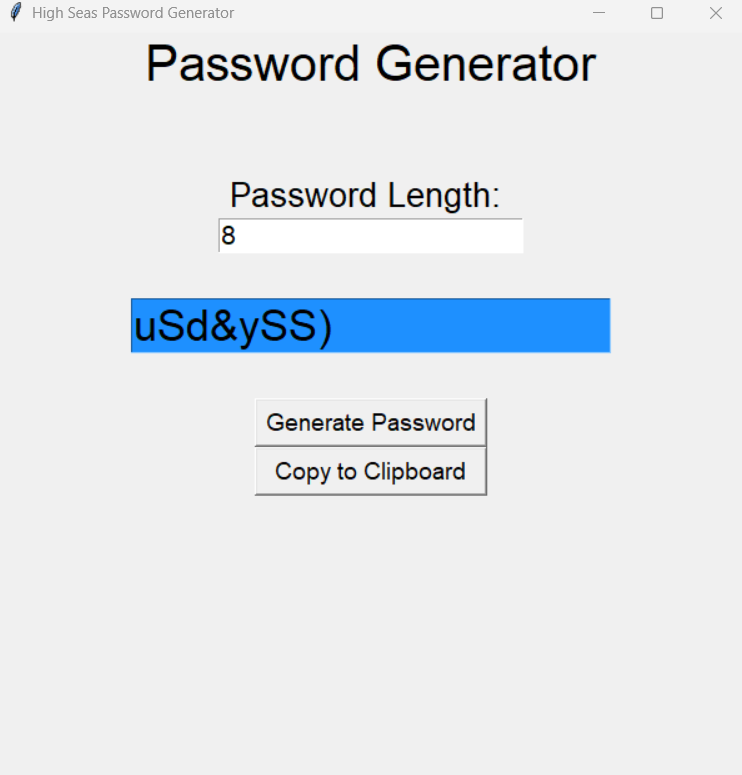

# high-seas-password-generator
A simple password generator written using Python and Tkinter. This program allows users to generate strong, random passwords containing uppercase letters, lowercase letters, numbers, and special characters. Perfect for establishing secure passwords for personal or professional usage.

# Steps to use the password generator
1. Select the length of the password - enter a number
2. Click the "Generate Password" button to create a random password
3. Click the "Copy to Clipboard" button to copy the password to your clipboard for easy use

# Demo Link:
https://youtu.be/-r34qSxUnuk
